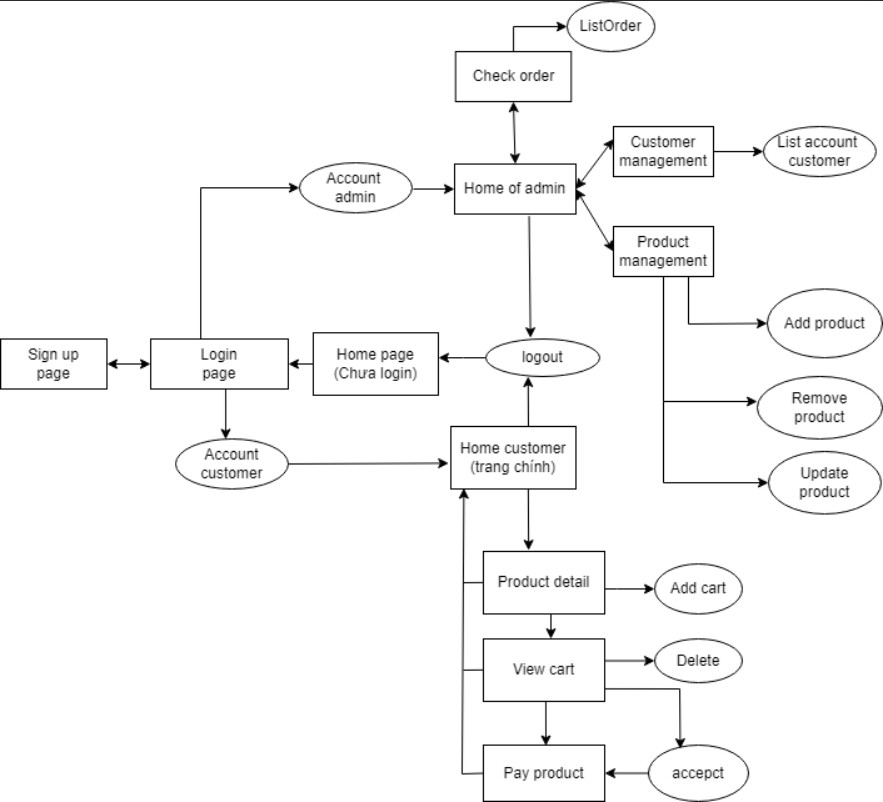
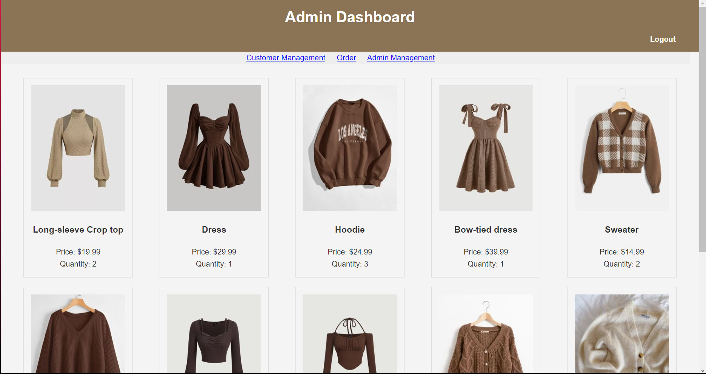
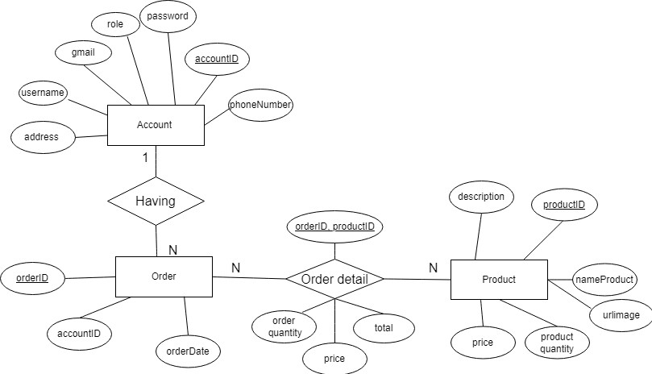
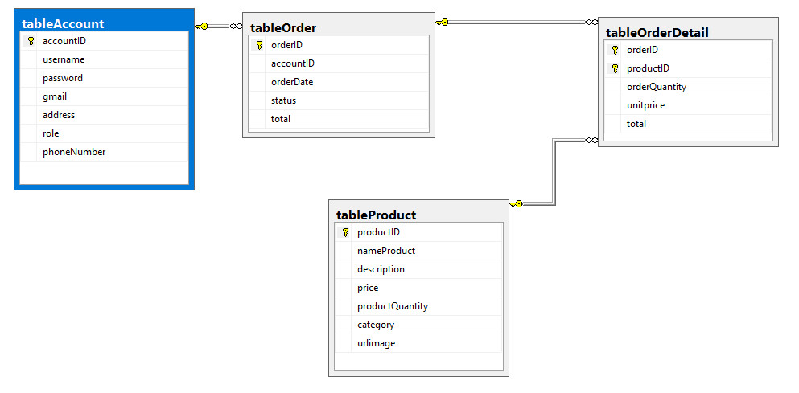

# **FPTUClothing**

## **Our members in charge**
Nguyễn Thanh Hải - SE171868 
Võ Quỳnh Ny - CA1608999 
Nguyễn Thanh Hải - SE160636 
Dương Đức Mạnh - SE173244 
Nguyễn Thị Mộng Quỳnh - SE160402 

## **Introduction:**
**FPTUClothing** is a online shopping website that give the joiful experience to user. Furthermore, **FPTUClothing** has a user-friendly UI which makes everything take place there go smoothly. The diversity of style that combines cultural and modern online shop. The application provides an effective store management.

## **Project target:**
Clothing shop owner and employee, customer.

## **Requirements**

When entering shop website, the default is **home page** with the shop logo. They _need to login_ and if they do not have an account, they _have to register_ a new account. After logging in, customers will be directed to **shopping page**, where they can see all clothes in the shop, they also can view more details of each garment by clicking on that item and if they are satisfied, just press the **add button** so that adding it to the cart. After choosing clothes that they want, customers can go to their shopping cart to confirm whether the products are worth-buying or not. If customers are not satisfied, they can delete it directly by _clicking the delete button_. Once everything is perfect, they can select the buy button to go to the **confirm page** where they can double check all the important information and choose the payment method, then if all things are good they can put the order to shop.

For store owners and staffs who are admins, they can login with the admin account to access the **admin home page**. Admin functions includes **order management** where admin can see the list of orders, **customer management** that helps admin viewing list of user account, and **product management** which provides admins list of products also can help adding, updating, or deleting products in their shop.

 

## List of functions:

### General purpose:

#### 1.Create user  
- Enter username, password, gmail and check password to create an account
- username (max length: 50 letters)
- Password (max length: 30 letters)
- Gmail (have '@gmail.com')
- User address(to take delivered product max length: 100 letters)
- Initial role of user account is user
#### 2.Login 
- Enter id, password to login
#### 3.Logout 
- Click a link to logout current account

### For admin:

#### 1.Add product
- Enter Product id, name, description, price. When a product added, its initial quantity always = 0. 
#### 2.Remove product
- Enter product id to remove
#### 3.Update product
- Enter product id to update 
- Cannot update product id 
#### 4.Show product list 
- Click link to go to page show list of product(id, name, description, price, quantity)
#### 5.Show user account infor
- Click a link to show the chosen user's infor(ID account, gmail, address)
#### 6.Show order list
- Click a link to show all orders 
- Order has 2 states(being booked, delivered)
#### 7. Finish order
- Click a button to confirm this order is delivered to customer

### For customer:

#### 1.Show product details 
- Click product name to show product detail
#### 2.Add product to cart
- Click button "add" to add product to your cart
#### 3.Remove product from cart
- Click button "delete" to revome product from cart
#### 4.Ordering product
- Click button "buy" to confirm and pay 
#### 5.Show customer's personal detail 
- Click link to show customer detail(Id, password, gmail)
#### 6.Update customer's personal detail 
- In a page customer check their infor they can edit them as they want

## Sitemap

## GUI
### guestHomepage

### customerHomepage

### adminHomepage

### loginPage

### CreateAccountPage

### CustomerManagementPage

### ViewCartPage

### ConfirmOrderPage

## Model 
### ERD

### Database diagram

## Conclusion

### Pros of the application

- **FPTUClothing is easy to use**: user no need to spend much time to understand how the application work.
- **FPTUClothing always show things in details**: application always provide the result in details to help user keeping track with their progress.
- **FPTUClothing is secured**: user can customize all their accounts' information.
- **FPTUClothing is adaptive**: user can contact to admin easily by the contact information in footer. If bug occurs user can contact to developer anytime.
  
### Cons of the application

- **FPTUClothing is slow**: application can not load many image in a short time, sometimes it causes bugs.
- **FPTUClothing is still in develop**: the application is lack of functions and still remaining many undetected bugs.
- **FPTUClothing is not always awake**: the application do not have any AI chat bot or way to contact to customer throught chatbox.

### Lessons during constructing FPTUClothing

- **Improving code writting skill**: we debuged it several times and get stuck then learn how to know to fix it.
- **How to appoarch, manage, analize a project**: it is our first time running a project. We learn how to analize the user requirements, how to make timeline and manage it to adapt deadline. We messed everything up then the workload stack to much at late stages. After all problems, we aware that we did many mistakes and still trying to find the solution.
- **Improving teamwork skill**: We sit together and learn how to seperate the project into 5 parts for our strong field, specialization.
  
### Updating of the application in the future

- **UI/UX**: can sort the list of product that showing to customer by product's category.
- **Repliable**: create the chat bot for automating response to customer in anytime and create chatbox for customer and shope owner.
- **Language**: update more and more language for application to reach the international users.

